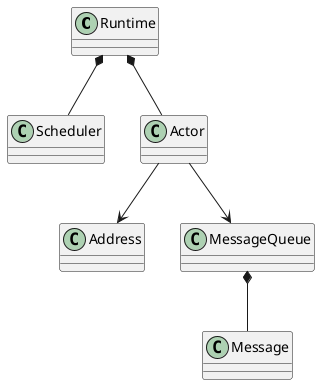

# Coactor

C++20 actor framework using coroutines.

## Next

- Support running coroutines as subroutines in `Actor::act()`, so that we don't
  have to put the whole actor in a single method.
- Implement message format other than raw `std::string`.
- Connect to external functions in two ways:
  - Synchronous, i.e. functions that block until done.
  - Asynchronous, i.e. functions that call a callback when done.
- One mutex per scheduler.

## Requirements

- Actor system inspired by Erlang, but using C++20 coroutines.
- There is an underlying runtime that enables the actor system.
- An actor can spawn other actors (called children).
- An actor should know its own address and its children's addresses.
- The scheduling is cooperative multitasking.
- There is one scheduler per thread.
- The system will start with a certain number of schedulers (parameter).
- There is no limit to how many actors may be assigned to a scheduler.
- Actor state is isolated from other actors.
- Need to have timeout functionality when waiting for messages.
- When running in inspection mode, we need:
  - Be able to halt execution (by blocking messages? What about timeouts?).
  - Visualize actors and messages.
  - Inspect message queues.
  - Slow down execution. How?

## Design

### Actors

- An **actor** has a **message queue** that contains **messages**.
- An actor has a unique **address**.
  The address does *not* depend on which scheduler it is running on, which means that an actor can change scheduler without changing address.
- An actor can send messages to actors that it has the address to.
- Actors have private **state**.
- Actors are isolated, in the sense that they can not access the state of other actors.
- Actors process the messages in the message queue in the same order as they were received.
- When a message is processed, the message and the actor state decides what the actor does.
- Actors can spawn new actors.

#### Actor addresses

Implemented as a 64-bit atomic counter.

#### Sending messages

TODO

#### Receiving messages

TODO

#### Spawning actors

TODO

#### Messages

A message can contain: TODO

#### Processing messages

TODO

### Scheduling

A **scheduler** organizes the execution of actors in a single thread.

### Runtime

A single **runtime** is constructed in the process.
The runtime owns the actors and organizes the schedulers.

### Inspector

The inspector is itself written using Coactor.
This means that all the information that the inspector can see must be accessible to any Coactor program.

## Implementation

### Coroutines

A **coroutine** is a function that can be suspended, and then resumed later.
A suspended coroutine saves its local variables, and restores them when it is resumed.
When a coroutine is suspended, it may yield data out to the caller.
The caller may send data into the coroutine when resuming it.

The implementation relies on coroutines as the basic async building block.
We can implement actors using coroutines by creating a mechanism for receiving and sending messages between coroutines.

### Actor implementation

Actors are implemented as coroutines.
The actor state consists of local variables in the coroutine.

The actor address is process-unique 64-bit unsigned integer.

An actor has a **status**, which can be **ready**, **running**, **blocked**, or **done**.

An actor has two layers: the **system layer** and the **user layer**.
The system layer takes care of all the background details and is defined by Coactor itself, but the user layer is defined by the programmer.

### Messages and system messages

Actors can send messages to each other.
These (ordinary) messages are actually just one type of **system messages** (called signals in Erlang), which are used for managing the actors.
E.g. there is a system message for requesting information about the actor, like the contents of its message queue, or the actor status.
The programmer does *not* write the code for reacting to system messages, only ordinary messages.

All the incoming system messages (including ordinary messages) for an actor go into the same message queue.

### Scheduler implementation

The schedulers should work similarly to the BEAM scheduler loop, as described in [The BEAM Book](https://blog.stenmans.org/theBeamBook/#_the_scheduler_loop).

When an actor waits for a message, its coroutine is suspended and control passes to its scheduler.
The scheduler then chooses which actor to pass control to.

#### Scheduler finite state machine

The actor statuses determine what the scheduler does.

When an actor is running (status *running*), the following can cause control to pass back to the scheduler:

- The actor is finished executing. The status becomes *done*.

- The actor tries to receive a message.
  - If there is a message in the message queue, execution continues in the actor.
  - If there are no messages in the message queue, the status becomes *blocked*, the actor coroutine is suspended and control passes to the scheduler.

### Inspector implementation

The inspector relies on using special system messages to request the information it needs.
The main system messages it needs are **actor_info_request** and **actor_info_reply**.

The inspector sends **actor_info_request** to another actor.
The actor will schedule processing the request.
The processing ends with replying to the inspector with **actor_info_reply** together with the info.

### Multiple schedulers

If we have two actors in different schedulers that want to send messages to each other, we need some sort of mechanism for avoiding message queue collision.

- The simplest solution is to protect each queue with a mutex, blocking access from multiple threads simultaneously.
- Another solution is to have some sort of lock-free multiple producer, single consumer (MPSC) queue.

### Runtime implementation

The runtime is the object that owns all the actors and schedulers.
When an actor wants to spawn another actor, it calls a method on the runtime object to spawn the new actor.
The method inserts the new actor into an appropriate scheduler so that it can begin execution.

The runtime can perform the following tasks:

- Spawn a new actor.
- Erase an actor.
- Send a message to an actor.

When an actor want to spawn an actor or send a message, it calls methods on the runtime to do this.

When actor A sends a message to actor B, the following will happen:

- If actor B has status *done*, nothing happens.
- If actor B has status *ready* or *running*, the message is placed in B's message queue.
- If actor B has status *blocked*, the message is placed in B's message queue and B's status becomes *ready*.
